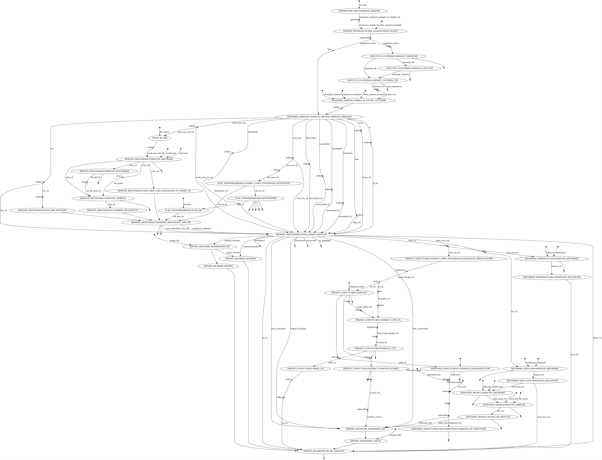

# MGnifams
Starting from MGnify proteins, MGnifams aim to: i) generate microbial sequence families to expand the currently known protein family space, ii) aid in their characterisation and iii) investigate potential novel functionalities.

## Nextflow pipeline
slurm:  
nextflow run main.nf -profile slurm,conda,singularity -with-tower 
local:  
nextflow run main.nf -profile test_local,conda,singularity



The end-to-end MGnifams pipeline chains the subworkflows of four thematically different workflows; setup_clusters, generate_nonredundant_families, annotate_families and export_db. After the pipeline finishes its execution, the produced db can be copied to either the mgnifams-site repo for local testing, or directly to ifs (/nfs/public/rw/metagenomics/mgnifams/dbs) to be finally deployed online with k8s.

The four thematic workflows can be seen below, along with their respective same-coloured subworkflows and modules:


After the db has been produced by the pipeline, do the following:  
* copy db to site/ifs  
* host online with k8s  

### 1. setup_clusters 
This is the first workflow to be executed before the main family generation. It consists of three subworkflows; preprocess_input, initiate_proteins and execute_clustering. In a nutshell, this workflow converts the initial input (see below) into family-generation-ready input.

The initial input for this pipeline is the output file of the protein-landing-page data generation pipeline, sequence_explorer_protein.csv (e.g., /nfs/production/rdf/metagenomics/users/vangelis/plp_flatfiles_pgsql_4/sequence_explorer_protein.csv). In case this file is compressed, there are two different decompression modes available; gz and bz2. Set the --compress_mode parameter accordingly. Then, the known pfam domains are sliced off from proteins and we filter the remaining proteins to be above a given length threshold with the min_sequence_length parameter (e.g., >=100 AA).

### 2. generate_nonredundant_families
This workflow is the essence of MGnifams and is responsible for converting initial clusters into nonredundant protein families. The clusters from the previous workflow are chunked (minimum_members threshold=50, for clusters to keep) and then, along with the mgnifams_input.fa file they are fed into the generate_families_parallel subworkflow, which iteratively recruits sequences in the families, for each clusters’ chunk. The results are then pooled and checked for transmembrane families (flagged and removed) and redundancy among families (keeping uniques) via the flag_transmembrane and remove_redundancy subworkflows. DeepTMHMM is used to predict TM protein regions. If TM regions (alpha or beta sheet) are more or equal to 0.4 of the total fam rep length, then the family is mapped as transmembrane and discarded. We chose a more relaxed threshold to flag families rather than the strict measure DeepTMHMM uses to flag them (lowest encountered so far 0.0840). To achieve removing redundancy, an hhsuite compatible database is created, incorporating all MGnifams, and then through hhblits, an initial filtering is carried out based on e-value scores. Then for each pair of remaining families a Jaccard index score is calculated for the base MGYPs in the families. If this score is equal or more than 0.5, the per Amino Acid Jaccard Similarities is also calculated. In more detail, if the rep from the first family is found in the second family, a per AA set is constructed for each family for all same-to-rep MGYPs in the family (subslices of the same protein/slice). If the second family doesn’t contain the rep of the first, we try the reverse (second family’s rep in the first family). If again it doesn’t exist, we do nothing. Else, we calculate the AA Jaccard Index; if it is equal or above 0.95 we remove the second family as redundant, else if it is above equal or 0.5 we write out the similarity edge between the two families, else we do nothing. The remaining families are then assigned a unique integer ID.

### 3. annotate_families
This workflow is responsible for pulling both model and structural annotations for MGnifams. The first subworkflow, reformat_msa, is used to reformat the MSA files to be usable for the downstream subworkflows. Then, distant Pfam annotations are searched through hhsuite/hhblits for the model through the annotate_models subworkflow. In parallel, the predict_structures subworkflow predicts the family representative structures (first sequence of full msa). In some cases, some very long sequences can’t receive sufficient GPU virtual memory on the cluster to predict their structures. These will show in the pdb*_scores.txt file as: 24/05/25 22:16:10 | INFO | root | Failed (CUDA out of memory) on sequence 80 of length 1180. The EXTRACT_LONG_FA gathers these sequences and runs the prediction on the CPU via the ESMFOLD_CPU module. The results of both GPU and CPU predictions are then merged and fed in the annotate_structures subworkflow. This subworkflow is responsible for identifying structural homologs by using foldseek against the PDB, AlphaFolDB and ESM databases.

### 4. export_db
The final workflow of the pipeline, export_db, creates the MGnifams database. This consists of three different execution units; the first one is parsing files from the outputs of the pipeline into MGnifam CSV tables. The second one is querying the MGnify Proteins database (PGSQL) for additional post-processing information regarding underlying biomes and domain architectures of the families. The third one is initialising the sqlite db with the schema and CSV tables, and then appends all BLOB files to the db. The db tables are; mgnifam, mgnifam_proteins, mgnifam_folds and mgnifam_pfams. The result post-processing files include two id-to-name mapping files (biomes and pfams from MGnify Proteins database), the query results for each family’s proteins for metadata against the MGnify Proteins database, the respective biome and domain results that are appended as BLOBs in the mgnifams database, along with other families generated from previous workflows (MSAs, HMM, CIF, etc.), and finally the resulting db incorporating all this data.

A db_config.ini filepath with secrets must be set in the export_db subworkflow nextflow.config.

```
[database]
dbname = ***
user = ***
password = ***
host = ***
port = ***
```

## Website
MGnifams site: http://mgnifams-demo.mgnify.org

GitHub repo: https://github.com/vagkaratzas/mgnifams-site

Quay image: quay.io/microbiome-informatics/mgnifams_site:ebi-wp-k8s-hl

## Final steps
Manually execute the next steps to finalise setting up the MGnifams website.

### Testing sqlite locally
Move the mgnifams.sqlite3 db to the mgnifams_site/dbs folder in the mgnifams-site repo.

python manage.py collectstatic --noinput  
python manage.py migrate --fake  
python manage.py runserver 0.0.0.0:8000

### Hosting with k8s
Move the db to /nfs/public/rw/metagenomics/mgnifams/dbs while on the datamover queue.  
slurm:  
salloc -t 3:30:00 --mem=8G -p datamover

Then, from the deployment folder of the website repo: https://github.com/EBI-Metagenomics/mgnifams-site

k8s:  
kubectl apply -f ebi-wp-k8s-hl.yaml

or restart:  
kubectl rollout restart deployment mgnifams-site

Make sure the kubeconfig.yaml at the home directory shows the correct namespace: mgnifams-hl-exp

#### If site changes
From within the main mgnifams-site repo:  
Update Docker image  
sudo systemctl start docker  
sudo docker build -t quay.io/microbiome-informatics/mgnifams_site:ebi-wp-k8s-hl .

Push to quay.io  
sudo docker login quay.io  
sudo docker push quay.io/microbiome-informatics/mgnifams_site:ebi-wp-k8s-hl

#### If the db was created on a local machine
Move sqlite3 DB from local machine to /nfs/public/rw/metagenomics/mgnifams/dbs  
slurm:  
salloc -t 3:30:00 --mem=8G -p datamover

wormhole send mgnifams_site/dbs/mgnifams.sqlite3

This needs to be added to ~/.zshrc:  
MIT_BASERC="/hps/software/users/rdf/metagenomics/service-team/repos/mi-automation/team_environments/codon/baserc.sh"

if [ -f $MIT_BASERC ]; then  
  . $MIT_BASERC  
fi  
mitload miniconda; conda activate wormhole

wormhole receive code-id (e.g., wormhole receive 8-saturday-endorse)

chmod 775 mgnifams.sqlite3 after moving the db there

## Anti bus-factor 1 measures
Currently, extra documentation can be found in the google doc: https://docs.google.com/document/d/1eeglnQb9M-D0iK9AFbTypLYvvKHeUg6XtzmlKN874k4/edit
