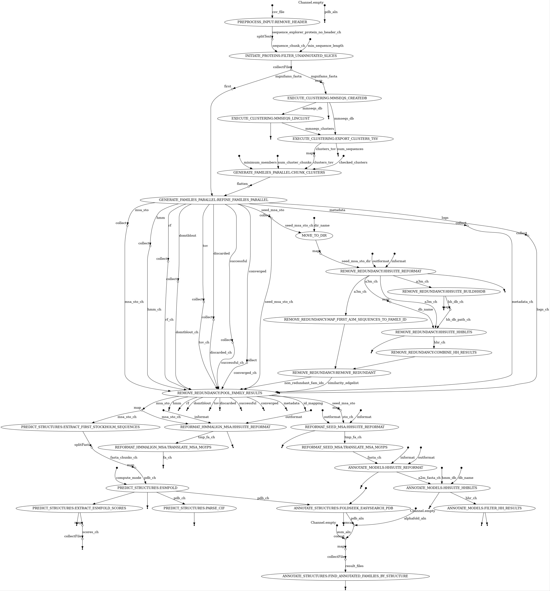

# MGnifams

Starting from MGnify proteins, MGnifams aims to generate microbial sequence families to expand the currently known protein family space and to investigate potential novel functionalities.

## Nextflow pipeline

slurm:  
nextflow run main.nf -c conf/end-to-end.config -profile slurm -with-tower  
local:  
nextflow run main.nf -c conf/end-to-end.config -profile local



The end-to-end MGnifams pipeline chains the subworkflows of three thematically different workflows; setup_clusters, generate_families and annotate_families. Running the whole end-to-end pipeline in one step is not realistic with the current number of input sequences, due to the lengthy execution of the generate_families subworkflow. This would find use for estimated input sets of 1-10M sequences instead of 700M. After the pipeline finishes, the export_data workflow must be executed to produce all necessary CSV files to be then imported in an sqlite database (mgnifams.sqlite3). Following, the bin/helper/append_blobs_sqlite.py must be run, to append all blob file items to the db. Then, the db must be copied to either the mgnifams-site repo for local testing, or directly to ifs (/nfs/public/rw/metagenomics/mgnifams/dbs) to be finally deployed online with k8s.

A more realistic scenario is breaking the MGnifams pipeline into four main workflows (each consisting of its respective same-coloured subworkflows below) and executing them one after the other as shown below:


After the export_data produces all necessary output tables, do the following:  
* import CSVs into sqlite db  
* append blobs to db  
* copy db to site/ifs  
* host online with k8s  

### 1. setup_clusters

slurm:  
nextflow run workflows/setup_clusters/main.nf -profile slurm -with-tower  
or local:  
nextflow run workflows/setup_clusters/main.nf -profile local  

This is the first workflow to be executed before the main family generation. It consists of three subworkflows; preprocess_input, initiate_proteins and execute_clustering. In a nutshell, this workflow converts the initial input (see below) into family-generation-ready input.

The initial input for this pipeline is the output file of the protein-landing-page data generation pipeline, sequence_explorer_protein.csv (e.g., /nfs/production/rdf/metagenomics/users/vangelis/plp_flatfiles_pgsql_4/sequence_explorer_protein.csv). In case this file is compressed, there are two different decompression modes available; gz and bz2. Set the --compress_mode parameter accordingly. Then, the known pfam domains are sliced off from proteins and we filter the remaining proteins to be above a given length threshold with the min_sequence_length parameter (e.g., >=100 AA).

### 2. generate_families

slurm:  
nextflow run workflows/generate_families/main.nf -profile slurm -with-tower -resume  
local:  
nextflow run workflows/generate_families/main.nf -profile local  

This workflow is the essence of MGnifams and is responsible for converting initial clusters into legit protein families. First, a pkl file is created for the clusters to be checked, for bookkeeping purposes. Then, along with the mgnifams_input.fa file they are fed into the bin/family/refine_families.py script, which iteratively recruits sequences in the families, starting from the largest family towards the smallest (minimum_members threshold 50).

#### Restart strategy

To continue from where the last family finished on the server execution, all updated_* files must be manually copied/moved from the work folder to the output/families directory (e.g., /nfs/production/rdf/metagenomics/users/vangelis/mgnifams/output/families). After removing or renaming (for backup) the old files there, the new ones must be renamed to the respective files without the udpated_ part. Also, make sure that the “iteration” parameter in nextflow.config in the generate_families subworkflow is set to the numeric value of the last properly checked family (e.g., if last generated family is 111, set the iteration param to 111). Add -resume to nextflow run, so the pkl generation module is not executed again.

### 3. annotate_families

slurm:  
nextflow run workflows/annotate_families/main.nf -profile slurm -with-tower -resume  
local:  
nextflow run workflows/annotate_families/main.nf -profile local  

This workflow is responsible for pulling both model and structural annotations for MGnifams. The first subworkflow, reformat_msa, is used to reformat the MSA files to be usable for the downstream subworkflows. Then, distant Pfam annotations are searched through hhsuite/hhblits for the model through the annotate_models subworkflow. In parallel, the predict_structures subworkflow predicts the family representative structures (first sequence of full msa) and then through the annotate_structures subworkflow tries to identify structural homologs by using foldseek against the PDB, AlphaFolDB and ESM databases. In some cases, some very long sequences can’t receive sufficient GPU virtual memory on the cluster to predict their structures. These must be manually gathered and executed with the cpu mode on.

### 4. export_data

slurm:  
nextflow run workflows/export_tables/main.nf -profile slurm -with-tower -resume  
local:  
nextflow run workflows/export_tables/main.nf -profile local  

The final workflow, export_data, creates all the CSV tables and BLOB files with all required data and metadata for the MGnifams database. This consists of two different execution units; the first one is parsing files from the output folder of the pipeline into the mgnifam tables and the second one is querying the MGnify Proteins database (PGSQL) for additional post-processing information regarding underlying biomes and domain architectures of families. The result CSV tables include; mgnifam.csv, mgnifam_proteins.csv, mgnifam_folds.csv and mgnifam_pfams.csv. The result post-processing files include two id-to-name mapping files (biomes and pfams from MGnify Proteins database), the query results for each family’s proteins for metadata against the MGnify Proteins database and finally the respective biome and domain results that are going to be appended as BLOBs in the mgnifams database, along with other families generated from previous workflows (MSAs, HMM, CIF, etc.).

A db_config.ini filepath with secrets must be set in the export_data nextflow.config.

```
[database]
dbname = ***
user = ***
password = ***
host = ***
port = ***
```

## Final steps

Manually execute the next steps to finalise setting up the MGnifams database and online website.

### Loading in sqlite

Step 1: Create the SQLite database from the schema  
sqlite3 DB/mgnifams.sqlite3 < DB/schema.sqlite

Step 2: Import data from CSV files  
Import the CSV table files into the database.  
For example, through datagrip, right click on each table and import respective file.

Step 3: Append BLOBs to db  
python bin/helper/append_blobs_sqlite.py

Step 4: Test the mgnifams-site locally  
python manage.py collectstatic --noinput
python manage.py migrate --fake
python manage.py runserver 0.0.0.0:8000

### Hosting with k8s

From within the main mgnifams-site repo:  
Update Docker image  
sudo systemctl start docker  
sudo docker build -t quay.io/microbiome-informatics/mgnifams_site:ebi-wp-k8s-hl .

Push to quay.io  
sudo docker login quay.io  
sudo docker push quay.io/microbiome-informatics/mgnifams_site:ebi-wp-k8s-hl

Move sqlite3 DB from local machine to /nfs/public/rw/metagenomics/mgnifams/dbs  
slurm:  
salloc -t 3:30:00 --mem=8G -p datamover

wormhole send mgnifams_site/dbs/mgnifams.sqlite3

This needs to be added to ~/.zshrc:  
MIT_BASERC="/hps/software/users/rdf/metagenomics/service-team/repos/mi-automation/team_environments/codon/baserc.sh"

if [ -f $MIT_BASERC ]; then  
  . $MIT_BASERC  
fi  
mitload miniconda; conda activate wormhole

wormhole receive code-id (e.g., wormhole receive 8-saturday-endorse)

chmod 775 mgnifams.sqlite3 after moving the db there

k8s:  
kubectl apply -f ebi-wp-k8s-hl.yaml

restarts:  
kubectl rollout restart deployment mgnifams-site

## Anti bus-factor 1 measures

Currently, extra documentation can be found in my google doc: https://docs.google.com/document/d/1eeglnQb9M-D0iK9AFbTypLYvvKHeUg6XtzmlKN874k4/edit
