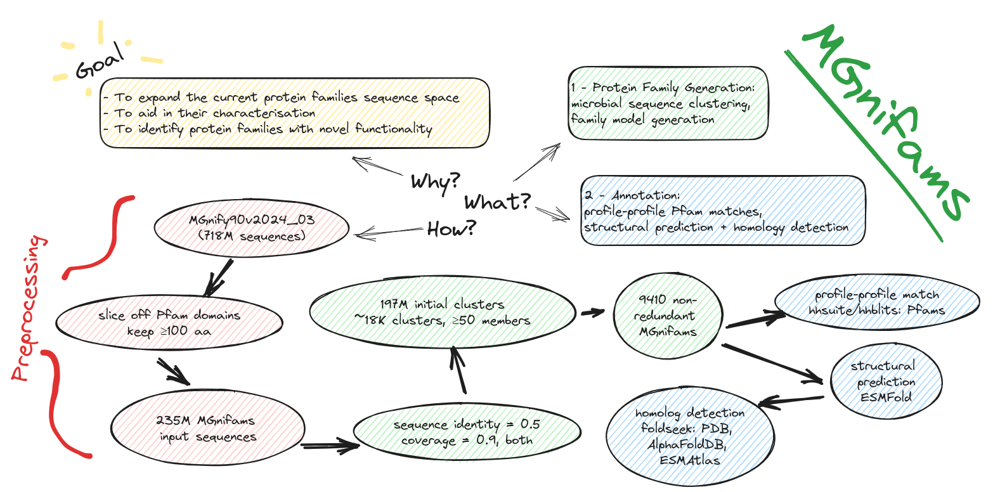
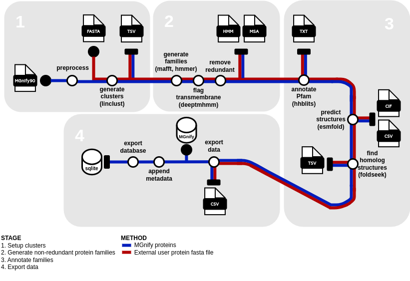
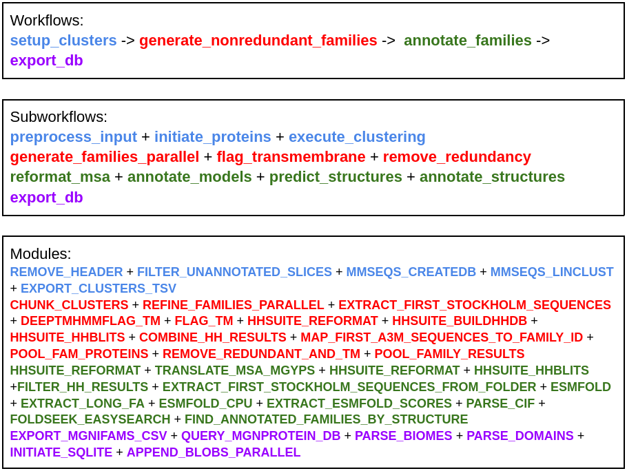

# MGnifams


## Nextflow pipeline

First, prepare a samplesheet with your input data that looks as follows:

`samplesheet.csv`:

```csv
sample,protein_input
plp2024,assets/test_data/sequence_explorer_protein_test_100001.csv
```

Now, you can run the pipeline either on slurm or locally.

slurm:
```bash
nextflow run main.nf -c path/to/slurm.config -profile test,slurm,conda,singularity -with-tower
```
local:
```bash
nextflow run main.nf -c path/to/local.config -profile test,local,conda,singularity
```



The end-to-end MGnifams pipeline chains the subworkflows of four thematically different workflows; setup_clusters, generate_nonredundant_families, annotate_families and export_db. After the pipeline finishes its execution, the produced db can be copied to either the mgnifams-site repo for local testing, or directly to ifs (path/to/metagenomics/mgnifams/dbs) to be finally deployed online with k8s.

The four thematic workflows can be seen below, along with their respective same-coloured subworkflows and modules:



After the db has been produced by the pipeline, do the following:  
* copy db to site/ifs  
* host online with k8s  

### 1. setup_clusters 
This is the first workflow to be executed before the main family generation. It consists of two subworkflows; extract_unannotated_fasta and execute_clustering. In a nutshell, this workflow converts the initial input (see below) into family-generation-ready input.

The initial input for this pipeline is the output file of the protein-landing-page data generation pipeline, sequence_explorer_protein.csv (e.g., path/to/plp_flatfiles_pgsql_4/sequence_explorer_protein.csv).

head:
```bash
mgyp,sequence,full_length,cluster_size,metadata
1127097383,MPMRVLYGLMFLSHLTTPSTLIANCWYNQMVRDDEITSSLKLMSLRRRTMEKMIVYGTRWCGDTRRSLRILDGREINYKWIDIDKDPEGEKFVKETNQGNRSVPTILFPDESILVEPSNQELNEKLDALSL,false,2,"{""s"":[[112156,[[781358,[[1218588979,1,396,1]]]]]],""b"":[[120,1]],""p"":[[""PF00462"",7.5e-8,39.0,2,58,53,113]]}"
3682963857,MSEIEKNIKEMIASNDVVLFMKGNPNQPQCGFSAKVVQCLKEVGKPFGYVDVLACLLYTSDAAD,false,3,"{""s"":[[133749,[[4291090,[[436986755,2,193,-1]]]]]],""b"":[[154,1]],""p"":[[""PF00462"",0.000011,32.1,1,32,17,56]]}"
1454792104,NEIDISRVDGAMDEMIKKANGKRTIPQIFFGEQHIGGYDEVRALEKEKKLQDLLK,false,1,"{""s"":[[104174,[[842953,[[393236313,739,906,-1]]]]]],""b"":[[158,1]],""p"":[[""PF00462"",0.00083,26.1,28,60,1,35]]}"
4689549003,MLFICYPKCSTCQKAKKWLDENGIDYTERHIVESNPTYEELKKWHAISGLPLKKFFNTSGMLYKEKKLKDKLPSMSEDEQLK,false,1,"{""s"":[[133688,[[4567313,[[752013464,2956,3201,1]]]]]],""b"":[[356,1]],""p"":[[""PF00462"",0.000027,30.8,7,45,1,52],[""PF03960"",0.00019,28.2,3,46,5,82]]}"
3125700799,MTASDQIKQTVTSHDVVLFMKGTKTMPQCGFSSRVAGVLNFMGIDYTDVNVLADDQIRQGIKDYSDWPTIPQLYVKGEFVGGCDIITEMTLSGELDTLLSDKGIAFDQAAADK,false,1,"{""s"":[[130231,[[2772491,[[1774364588,459,797,1]]]]]],""b"":[[132,1]],""p"":[[""PF00462"",1.5e-17,70.1,1,60,16,80]]}"
1248493701,MTIIVYGTQTCSQCKMFKEKLEENNIDFNSTDDLETLLDLSEKTGIMSAPIVKIEDEYFDTMGAFKKIGLC,true,6,"{""s"":[[112618,[[795058,[[328816056,2554,2769,-1]]]]],[112596,[[795030,[[232524699,1534,1749,-1]]]]]],""b"":[[63,2]],""p"":[[""PF00462"",0.00015,28.4,1,59,3,59]]}"
6079945953,MDKIKNAINDYVIISKKNCVFCDMVNELLDDNFIDYTVIKIETLSEDELNEIKPEEAKKYPFIFKNKIYIGSYNELKKELNN,true,3,"{""s"":[[136659,[[7462376,[[1835504261,23748,23996,-1]]]]]],""b"":[[132,1]],""p"":[[""PF00462"",0.00014,28.6,2,56,11,70]]}"
1821912652,RQRQMCIRDRAVTMFALEWCEFCWSIRKLFETCGIEYRSVDLDSVAYQEGDLGGRLRAALHARTGSPTVPQVFVGETYVGGCTETLDAFRSGELQRLLERDGVPYSAPAGLDPGKLLPAWLHPR,false,1,"{""s"":[[125457,[[1689011,[[989761960,1,375,1]]]]]],""b"":[[88,1]],""p"":[[""PF00462"",1.5e-12,54.1,1,60,12,79]]}"
760903384,MNIQIFGTSKCFDTKKAQRYFKERGIKFQMIDLKEKEMSRGEFENVARALGGWEKLVDPNAKDKQTLALLDALVDWQKEDKLFENQQLLRTPIVRNGRKATVGYQPDVSVSYTHLRAHE,false,1,"{""s"":[[108957,[[654179,[[823249866,507,863,1]]]]]],""b"":[[361,1]],""p"":[[""PF00462"",0.0021,24.8,2,48,3,56],[""PF03960"",8.6e-6,32.5,1,74,6,110]]}"
```
In case this file is compressed, there are two different decompression modes available; gz and bz2. Set the --compress_mode parameter accordingly. Then, the known pfam domains (or previous versions MGnifams domains) are sliced off from proteins and we filter the remaining proteins to be above a given length threshold with the min_sequence_length parameter (e.g., >=100 AA).

### 2. generate_nonredundant_families
This workflow is the essence of MGnifams and is responsible for converting initial clusters into nonredundant protein families. The clusters from the previous workflow are chunked (minimum_members threshold=25, for clusters to keep) and then, along with the `mgnifams_input.fa` file they are fed into the `generate_families` subworkflow, which iteratively recruits sequences in the families, for each clusters’ chunk. The results are then pooled and checked for redundancy among families (keeping uniques) via the `remove_redundancy` subworkflow. The remaining families are then assigned a unique integer ID.

### 3. annotate_families
This workflow is responsible for pulling both model and structural annotations for MGnifams. The first subworkflow, reformat_msa, is used to reformat the MSA files to be usable for the downstream subworkflows. Then, distant Pfam annotations are searched through hhsuite/hhblits for the model through the annotate_models subworkflow. In parallel, the predict_structures subworkflow predicts the family representative structures (first sequence of full msa). In some cases, some very long sequences can’t receive sufficient GPU virtual memory on the cluster to predict their structures. These will show in the pdb*_scores.txt file as: 24/05/25 22:16:10 | INFO | root | Failed (CUDA out of memory) on sequence 80 of length 1180. The EXTRACT_LONG_FA gathers these sequences and runs the prediction on the CPU via the ESMFOLD_CPU module. The results of both GPU and CPU predictions are then merged and fed in the annotate_structures subworkflow. This subworkflow is responsible for identifying structural homologs by using foldseek against the PDB, AlphaFolDB and ESM databases.

### 4. export_db
The final workflow of the pipeline, export_db, creates the MGnifams database. This consists of three different execution units; the first one is parsing files from the outputs of the pipeline into MGnifam CSV tables. The second one is querying the MGnify Proteins database (PGSQL) for additional post-processing information regarding underlying biomes and domain architectures of the families. The third one is initialising the sqlite db with the schema and CSV tables, and then appends all BLOB files to the db. The db tables are; mgnifam, mgnifam_proteins, mgnifam_folds and mgnifam_pfams. The result post-processing files include two id-to-name mapping files (biomes and pfams from MGnify Proteins database), the query results for each family’s proteins for metadata against the MGnify Proteins database, the respective biome and domain results that are appended as BLOBs in the mgnifams database, along with other families generated from previous workflows (MSAs, HMM, CIF, etc.), and finally the resulting db incorporating all this data.

A db_config.ini filepath with secrets must be set in the export_db subworkflow nextflow.config.

```
[database]
dbname = ***
user = ***
password = ***
host = ***
port = ***
```

## Website
MGnifams site: http://mgnifams-demo.mgnify.org

GitHub repo: https://github.com/vagkaratzas/mgnifams-site

Quay image: quay.io/microbiome-informatics/mgnifams_site:ebi-wp-k8s-hl

## Final steps
Manually execute the next steps to finalise setting up the MGnifams website.

### Testing sqlite locally
Move the mgnifams.sqlite3 db to the mgnifams_site/dbs folder in the mgnifams-site repo.

python manage.py collectstatic --noinput  
python manage.py migrate --fake  
python manage.py runserver 0.0.0.0:8000

### Hosting with k8s
Move the db to path/to/metagenomics/mgnifams/dbs while on the datamover queue.  
slurm:  
salloc -t 3:30:00 --mem=8G -p datamover

Then, from the deployment folder of the website repo: https://github.com/EBI-Metagenomics/mgnifams-site

k8s:  
kubectl apply -f ebi-wp-k8s-hl.yaml

or restart:  
kubectl rollout restart deployment mgnifams-site

Make sure the kubeconfig.yaml at the home directory shows the correct namespace: mgnifams-hl-exp

#### If site changes
From within the main mgnifams-site repo:  
Update Docker image  
sudo systemctl start docker  
sudo docker build -t quay.io/microbiome-informatics/mgnifams_site:ebi-wp-k8s-hl .

Push to quay.io  
sudo docker login quay.io  
sudo docker push quay.io/microbiome-informatics/mgnifams_site:ebi-wp-k8s-hl

#### If the db was created on a local machine
Move sqlite3 DB from local machine to path/to/metagenomics/mgnifams/dbs  
slurm:  
salloc -t 3:30:00 --mem=8G -p datamover

wormhole send mgnifams_site/dbs/mgnifams.sqlite3

This needs to be added to ~/.zshrc:  
MIT_BASERC="path/to/team_environments/codon/baserc.sh"

if [ -f $MIT_BASERC ]; then  
  . $MIT_BASERC  
fi  
mitload miniconda; conda activate wormhole

wormhole receive code-id (e.g., wormhole receive 8-saturday-endorse)

chmod 775 mgnifams.sqlite3 after moving the db there

## Anti bus-factor 1 measures
Currently, extra documentation can be found in the google doc: https://docs.google.com/document/d/1eeglnQb9M-D0iK9AFbTypLYvvKHeUg6XtzmlKN874k4/edit

## External usage
The pipeline is also useable outside the MGnify team, given a protein fasta file as input.
The **--input** parameter denotes the fasta file and the **--fasta_input_mode** flag parameter must be set to true.

Example usage:
```
nextflow run main.nf -c path/to/local.config -profile test,local,conda,singularity --input assets/test_data/mgnifams_input.fa  --fasta_input_mode true
```
**
The HHsuite Pfam database (https://wwwuser.gwdguser.de/~compbiol/data/hhsuite/databases/hhsuite_dbs/pfamA_35.0.tar.gz) and the respective foldseek databases (foldseek downloads command for PDB and optionally AlphaFold and ESMAtlas, https://github.com/steineggerlab/foldseek) must be downloaded by the user and the parameters **hhdb_folder_path** and **foldseek_db_path** must be set accordingly. A working conda environment for esm-fold must be also set manually, and the **esm_conda_path** parameter must be updated with that path.

<details>
  <summary>Show conda env recipe</summary>

  ### Conda env recipe

```
name: esmfold  
channels:
  - pytorch
  - nvidia
  - conda-forge
  - bioconda
dependencies:
  - _libgcc_mutex=0.1=conda_forge
  - _openmp_mutex=4.5=2_kmp_llvm
  - absl-py=2.0.0=pyhd8ed1ab_0
  - antlr-python-runtime=4.9.3=pyhd8ed1ab_1
  - archspec=0.2.2=pyhd8ed1ab_0
  - blas=1.0=mkl
  - boltons=23.0.0=pyhd8ed1ab_0
  - brotli-python=1.1.0=py38h17151c0_1
  - bzip2=1.0.8=hd590300_5
  - c-ares=1.21.0=hd590300_0
  - ca-certificates=2023.08.22=h06a4308_0
  - certifi=2023.7.22=pyhd8ed1ab_0
  - cffi=1.16.0=py38h6d47a40_0
  - charset-normalizer=3.3.2=pyhd8ed1ab_0
  - colorama=0.4.6=pyhd8ed1ab_0
  - conda=23.10.0=py38h578d9bd_1
  - conda-libmamba-solver=23.11.0=pyhd8ed1ab_0
  - conda-package-handling=2.2.0=pyh38be061_0
  - conda-package-streaming=0.9.0=pyhd8ed1ab_0
  - contextlib2=21.6.0=pyhd8ed1ab_0
  - cuda-cudart=12.1.105=0
  - cuda-cupti=12.1.105=0
  - cuda-libraries=12.1.0=0
  - cuda-nvcc=12.3.52=0
  - cuda-nvrtc=12.1.105=0
  - cuda-nvtx=12.1.105=0
  - cuda-opencl=12.3.52=0
  - cuda-runtime=12.1.0=0
  - cudatoolkit=11.8.0=h6a678d5_0
  - einops=0.7.0=pyhd8ed1ab_1
  - filelock=3.13.1=pyhd8ed1ab_0
  - fmt=10.1.1=h00ab1b0_0
  - gmp=6.2.1=h58526e2_0
  - gmpy2=2.1.2=py38h793c122_1
  - icu=73.2=h59595ed_0
  - idna=3.4=pyhd8ed1ab_0
  - ihm=0.41=py38h01eb140_0
  - intel-openmp=2023.1.0=hdb19cb5_46305
  - jinja2=3.1.2=pyhd8ed1ab_1
  - jsonpatch=1.33=pyhd8ed1ab_0
  - jsonpointer=2.4=py38h578d9bd_3
  - keyutils=1.6.1=h166bdaf_0
  - krb5=1.21.2=h659d440_0
  - ld_impl_linux-64=2.40=h41732ed_0
  - libarchive=3.7.2=h039dbb9_0
  - libblas=3.9.0=12_linux64_mkl
  - libcblas=3.9.0=12_linux64_mkl
  - libcublas=12.1.0.26=0
  - libcufft=11.0.2.4=0
  - libcufile=1.8.0.34=0
  - libcurand=10.3.4.52=0
  - libcurl=8.4.0=hca28451_0
  - libcusolver=11.4.4.55=0
  - libcusparse=12.0.2.55=0
  - libedit=3.1.20191231=he28a2e2_2
  - libev=4.33=h516909a_1
  - libffi=3.4.2=h7f98852_5
  - libgcc-ng=13.2.0=h807b86a_2
  - libgfortran-ng=11.2.0=h00389a5_1
  - libgfortran5=11.2.0=h1234567_1
  - libhwloc=2.9.3=default_h554bfaf_1009
  - libiconv=1.17=h166bdaf_0
  - liblapack=3.9.0=12_linux64_mkl
  - libmamba=1.5.3=had39da4_1
  - libmambapy=1.5.3=py38h5cd715c_1
  - libnghttp2=1.55.1=h47da74e_0
  - libnpp=12.0.2.50=0
  - libnsl=2.0.1=hd590300_0
  - libnvjitlink=12.1.105=0
  - libnvjpeg=12.1.1.14=0
  - libsolv=0.7.26=hfc55251_0
  - libsqlite=3.44.0=h2797004_0
  - libssh2=1.11.0=h0841786_0
  - libstdcxx-ng=13.2.0=h7e041cc_2
  - libuuid=2.38.1=h0b41bf4_0
  - libuv=1.46.0=hd590300_0
  - libxml2=2.11.5=h232c23b_1
  - libzlib=1.2.13=hd590300_5
  - llvm-openmp=15.0.7=h0cdce71_0
  - lz4-c=1.9.4=hcb278e6_0
  - lzo=2.10=h516909a_1000
  - markupsafe=2.1.3=py38h01eb140_1
  - mkl=2021.4.0=h8d4b97c_729
  - mkl-service=2.4.0=py38h95df7f1_0
  - mkl_fft=1.3.1=py38h8666266_1
  - mkl_random=1.2.2=py38h1abd341_0
  - ml-collections=0.1.1=pyhd8ed1ab_0
  - modelcif=0.9=pyhd8ed1ab_0
  - mpc=1.3.1=hfe3b2da_0
  - mpfr=4.2.1=h9458935_0
  - mpmath=1.3.0=pyhd8ed1ab_0
  - msgpack-python=1.0.6=py38h7f3f72f_0
  - ncurses=6.4=h59595ed_2
  - networkx=3.1=pyhd8ed1ab_0
  - numpy=1.21.2=py38h20f2e39_0
  - numpy-base=1.21.2=py38h79a1101_0
  - omegaconf=2.3.0=pyhd8ed1ab_0
  - openssl=3.1.4=hd590300_0
  - packaging=23.2=pyhd8ed1ab_0
  - pip=23.3.1=pyhd8ed1ab_0
  - platformdirs=3.10.0=py38h06a4308_0
  - pluggy=1.3.0=pyhd8ed1ab_0
  - pooch=1.7.0=py38h06a4308_0
  - pybind11-abi=4=hd8ed1ab_3
  - pycosat=0.6.6=py38h01eb140_0
  - pycparser=2.21=pyhd8ed1ab_0
  - pysocks=1.7.1=pyha2e5f31_6
  - python=3.8.18=hd12c33a_0_cpython
  - python_abi=3.8=4_cp38
  - pytorch=1.11.0=py3.8_cpu_0
  - pytorch-cuda=12.1=ha16c6d3_5
  - pytorch-mutex=1.0=cpu
  - pyyaml=6.0.1=py38h01eb140_1
  - readline=8.2=h8228510_1
  - reproc=14.2.4.post0=hd590300_1
  - reproc-cpp=14.2.4.post0=h59595ed_1
  - requests=2.31.0=pyhd8ed1ab_0
  - ruamel.yaml=0.18.5=py38h01eb140_0
  - ruamel.yaml.clib=0.2.7=py38h01eb140_2
  - scipy=1.7.1=py38h56a6a73_0
  - setuptools=68.2.2=pyhd8ed1ab_0
  - six=1.16.0=pyh6c4a22f_0
  - sympy=1.12=pypyh9d50eac_103
  - tbb=2021.10.0=h00ab1b0_2
  - tk=8.6.13=noxft_h4845f30_101
  - torchtriton=2.1.0=py38
  - tqdm=4.66.1=pyhd8ed1ab_0
  - typing_extensions=4.8.0=pyha770c72_0
  - urllib3=2.0.7=pyhd8ed1ab_0
  - wheel=0.41.3=pyhd8ed1ab_0
  - xz=5.2.6=h166bdaf_0
  - yaml=0.2.5=h7f98852_2
  - yaml-cpp=0.8.0=h59595ed_0
  - zlib=1.2.13=hd590300_5
  - zstandard=0.22.0=py38ha98ab4e_0
  - zstd=1.5.5=hfc55251_0
  - pip:
    - biopython==1.79
    - dm-tree==0.1.8
    - fair-esm==2.0.0
    - git+https://github.com/facebookresearch/esm.git
    - 'openfold @ git+https://github.com/aqlaboratory/openfold.git'
```
</details>
