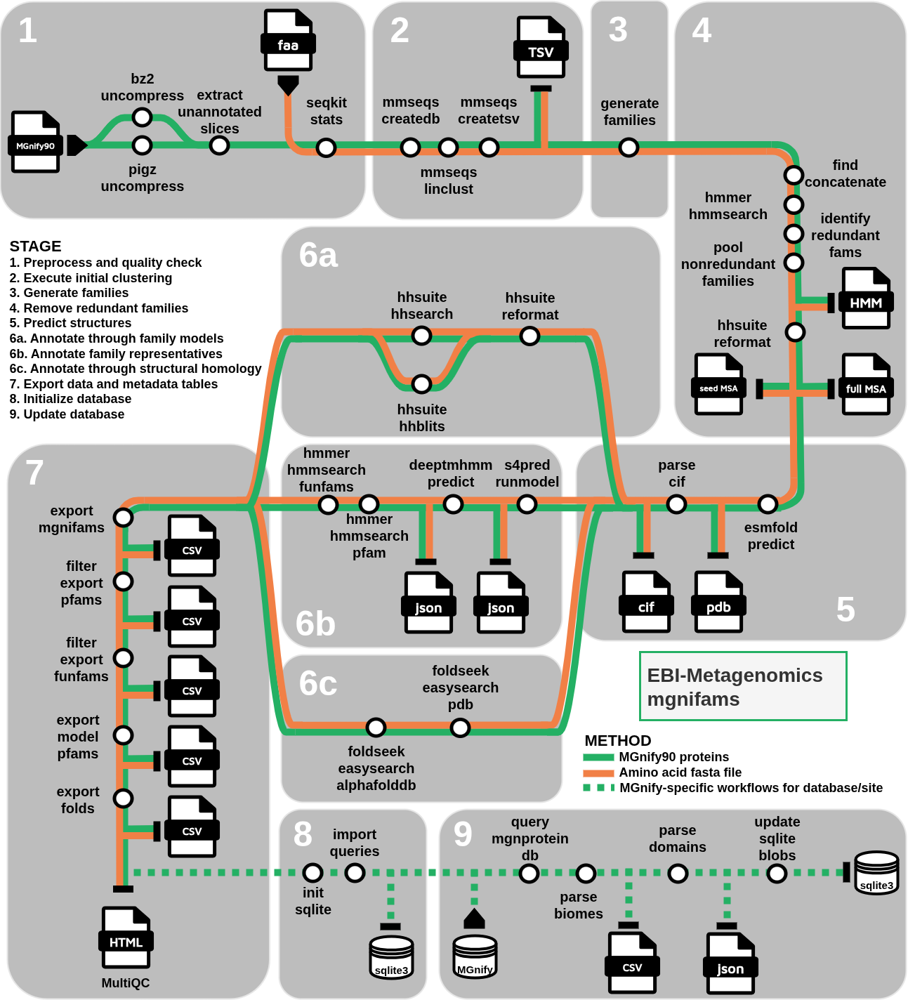

# MGnifams
From metagenomics derived amino acid sequences, to protein families.

## Nextflow pipeline
This pipeline is developed in Nextflow, following nf-core standards.

### Input
`samplesheet.csv`

First, for a MGnify-specific execution, prepare a samplesheet with input data that looks as follows:

```csv
sample,protein_input
plp2024,/path/to/assets/test_data/sequence_explorer_protein_test_100001.csv.gz
```

The `csv` is the output file of the `mgnify-proteins` pipeline.

Alternatively, by setting the `--fasta_input_mode` parameter to `true`, the input can be an amino acid `fasta` file:

```csv
sample,protein_input
fasta,/path/to/test.fasta
```

### Test runs
Now, you can run the pipeline either on slurm or locally.

slurm:
```bash
nextflow run mgnifams -c conf/slurm.config --input mgnifams/input/samplesheet_test.csv -profile test,slurm,singularity,gpu -resume -with-tower
```
local:
```bash
nextflow run mgnifams -c conf/local.config --input mgnifams/input/samplesheet_test.csv -profile test,local,singularity -resume
```

For MGnify-specific executions, the `init_db` adn `update_db` workflows must be executed after a whole run
to produce the `sqlite` database that hosts all data and metadata for the MGnifams site.

init_db:
```bash
nextflow run mgnifams -c conf/slurm.config --input mgnifams/input/samplesheet_init_db.csv --mode init_mgnifams_db --outdir '/path/to/mgnifams/output_db' -profile slurm,singularity -resume -with-tower
```

update_db:
```bash
nextflow run mgnifams -c conf/slurm.config --input mgnifams/input/samplesheet_update_db.csv --mode update_mgnifams_db --outdir '/path/to/mgnifams/output_db' -profile slurm,singularity -resume -with-tower
```

#### End-to-end nf-test
```
nf-test test tests/default.nf.test --profile +singularity,test
```

The test profile will still need to be updated with the following local variables and paths:
```
    use_gpu             = false
    esmfold_db          = 'path/to/esmfold/'
    esmfold_params_path = 'path/to/esmfold/params/*'

    // ANNOTATE_FAMILIES
    // annotate_reps
    pfam_path        = 'path/to/Pfam-A.38.0.hmm.gz'
    funfams_path     = 'path/to/funfam-hmm3-v4_3_0_test.lib.gz'
    // annotate_models
    hhdb_path        = 'path/to/pfamA_35.0'
    // annotate_structures
    foldseek_db_path = 'path/to/foldseek'
```

### Overview


The end-to-end MGnifams pipeline chains five major subworkflows; `setup_clusters`, `generate_nonredundant_families`, `predict_structures`, `annotate_families` and `export_data`.

For MGnify only; After the main pipeline finishes its execution, `init_db` and `update_db` must be executed. Then, the produced `sqlite` database can be copied to either the mgnifams-site repo for local testing, or directly to ifs (path/to/metagenomics/mgnifams/dbs) to be finally deployed online with k8s.

After the db has been produced by the pipeline, do the following:  
* copy database to site/ifs  
* host online with k8s  

### mgnifams workflow
This is the main pipeline that receives an input file (MGnify proteins `CSV` or `fasta`) and generates MGnifams data along with metadata and annotations.

#### 1. setup_clusters 
This is the first subworkflow to be executed before the main family generation. It consists of three subworkflows; `extract_unannotated_fasta`, `check_quality` and `execute_clustering`. In a nutshell, this suborkflow converts the initial input (see below) into family-generation-ready input.

The initial input for this pipeline is the output file of the `mgnify-proteins` data generation pipeline, `sequence_explorer_protein.csv` (e.g., `path/to/plp_flatfiles_pgsql_4/sequence_explorer_protein.csv`).

head:
```bash
mgyp,sequence,full_length,cluster_size,metadata
1127097383,MPMRVLYGLMFLSHLTTPSTLIANCWYNQMVRDDEITSSLKLMSLRRRTMEKMIVYGTRWCGDTRRSLRILDGREINYKWIDIDKDPEGEKFVKETNQGNRSVPTILFPDESILVEPSNQELNEKLDALSL,false,2,"{""s"":[[112156,[[781358,[[1218588979,1,396,1]]]]]],""b"":[[120,1]],""p"":[[""PF00462"",7.5e-8,39.0,2,58,53,113]]}"
3682963857,MSEIEKNIKEMIASNDVVLFMKGNPNQPQCGFSAKVVQCLKEVGKPFGYVDVLACLLYTSDAAD,false,3,"{""s"":[[133749,[[4291090,[[436986755,2,193,-1]]]]]],""b"":[[154,1]],""p"":[[""PF00462"",0.000011,32.1,1,32,17,56]]}"
1454792104,NEIDISRVDGAMDEMIKKANGKRTIPQIFFGEQHIGGYDEVRALEKEKKLQDLLK,false,1,"{""s"":[[104174,[[842953,[[393236313,739,906,-1]]]]]],""b"":[[158,1]],""p"":[[""PF00462"",0.00083,26.1,28,60,1,35]]}"
4689549003,MLFICYPKCSTCQKAKKWLDENGIDYTERHIVESNPTYEELKKWHAISGLPLKKFFNTSGMLYKEKKLKDKLPSMSEDEQLK,false,1,"{""s"":[[133688,[[4567313,[[752013464,2956,3201,1]]]]]],""b"":[[356,1]],""p"":[[""PF00462"",0.000027,30.8,7,45,1,52],[""PF03960"",0.00019,28.2,3,46,5,82]]}"
3125700799,MTASDQIKQTVTSHDVVLFMKGTKTMPQCGFSSRVAGVLNFMGIDYTDVNVLADDQIRQGIKDYSDWPTIPQLYVKGEFVGGCDIITEMTLSGELDTLLSDKGIAFDQAAADK,false,1,"{""s"":[[130231,[[2772491,[[1774364588,459,797,1]]]]]],""b"":[[132,1]],""p"":[[""PF00462"",1.5e-17,70.1,1,60,16,80]]}"
1248493701,MTIIVYGTQTCSQCKMFKEKLEENNIDFNSTDDLETLLDLSEKTGIMSAPIVKIEDEYFDTMGAFKKIGLC,true,6,"{""s"":[[112618,[[795058,[[328816056,2554,2769,-1]]]]],[112596,[[795030,[[232524699,1534,1749,-1]]]]]],""b"":[[63,2]],""p"":[[""PF00462"",0.00015,28.4,1,59,3,59]]}"
6079945953,MDKIKNAINDYVIISKKNCVFCDMVNELLDDNFIDYTVIKIETLSEDELNEIKPEEAKKYPFIFKNKIYIGSYNELKKELNN,true,3,"{""s"":[[136659,[[7462376,[[1835504261,23748,23996,-1]]]]]],""b"":[[132,1]],""p"":[[""PF00462"",0.00014,28.6,2,56,11,70]]}"
1821912652,RQRQMCIRDRAVTMFALEWCEFCWSIRKLFETCGIEYRSVDLDSVAYQEGDLGGRLRAALHARTGSPTVPQVFVGETYVGGCTETLDAFRSGELQRLLERDGVPYSAPAGLDPGKLLPAWLHPR,false,1,"{""s"":[[125457,[[1689011,[[989761960,1,375,1]]]]]],""b"":[[88,1]],""p"":[[""PF00462"",1.5e-12,54.1,1,60,12,79]]}"
760903384,MNIQIFGTSKCFDTKKAQRYFKERGIKFQMIDLKEKEMSRGEFENVARALGGWEKLVDPNAKDKQTLALLDALVDWQKEDKLFENQQLLRTPIVRNGRKATVGYQPDVSVSYTHLRAHE,false,1,"{""s"":[[108957,[[654179,[[823249866,507,863,1]]]]]],""b"":[[361,1]],""p"":[[""PF00462"",0.0021,24.8,2,48,3,56],[""PF03960"",8.6e-6,32.5,1,74,6,110]]}"
```

In case this file is compressed, there are two different decompression modes available; `gz` and `bz2`. Set the `--compress_mode` parameter accordingly. Then, the known pfam domains (or previous versions MGnifams domains) are sliced off from proteins and we filter the remaining proteins to be above a given length threshold with the `min_sequence_length` parameter (e.g., >=75 AA).

Alternatively, an amino acid fasta file can be passed through the samplesheet while setting the `--fasta_input_mode` parameter to `true`.

Following, a quality statistics report is produced via `seqkit/stats`. Sequences are then clustered via the `mmseqs` suite and are chunked for downstream parallel processing.

#### 2. generate_nonredundant_families
This subworkflow is the essence of MGnifams and is responsible for converting initial sequence clusters into non-redundant protein families. The `TSV` clusters from the previous subworkflow are fed into the `generate_families` subworkflow along with the `mgnifams_input.fa` file.
The core MGnifams algorithm utilizes the `pyhmmer`, `pyfamsa` and `pytrimal` libraries to produce protein families.
For a cluster, the algorithm creates an initial seed alignment with `pyfamsa` and then iteratively recruits sequences with `pyhmmer/hmmsearch`. 
Sequences that pass set filters are then aligned to the seed HMM via `pyhmmer/hmmalign`.
Until the model converges (no new sequences added to the alignment or up to three iterations), the aligned sequences are trimmed down with `pytrimal` to create an updated seed alignment to further recruit sequences from the initial fasta set.
Finally, the full alignment will contain all sequences that matched the final family model (created from the final seed alignment), including smaller sequences (not using a length filter here).
The results are then pooled and checked for redundancy among families via the `remove_redundancy` subworkflow. The remaining families are then assigned a unique integer identifier.
Metadata regarding the remaining families (`Family Id,Size,Representative Id,Region,Representative Length,Sequence,HMM consensus,Converged`) as well as the discarded families (`Cluster Representative,Discard Reason,Value`) are provided.

#### 3. predict_structures
ESMFold is used here on the family representative sequences, similarly to the [nf-core/proteinfold pipeline](https://github.com/nf-core/proteinfold).
Each predicted structure is kept in the original `pdb` format and also parsed into a `cif` format along with its plddt and ptm scores.
In some cases, some very long sequences do not receive sufficient GPU virtual memory on the cluster to predict structures.
These will show in the `pdb*_scores.txt` file as: `24/05/25 22:16:10 | INFO | root | Failed (CUDA out of memory) on sequence 80 of length 1180`. The `EXTRACT_CUDA_FAILED` module gathers these sequences and runs the prediction on the CPU via the `RUN_ESMFOLD_CPU` module.

#### 4. annotate_families
This subworkflow is comprised of three subworkflows that aim to annotate families via model annotation, structural homology and family representative sequence annotation.
The `annotate_reps` subworkflow, runs the `s4pred` software to predict the secondary structure feature composition of representative sequences.
It also run the `deeptmhmm` software to predict transmembrane regions.
Finally, `hmmsearch` is run against `funfams` and `pfam` to assign functional and domain annotation to MGnifams.

The `annotate_models` subworkflow, performs an `hhsuite/hhsearch` with the family HMM to draw family-level Pfam annotations.

The `annotate_structures` subworkflow, performs a `foldseek/easysearch` against PDB and ALPHAFOLDDB.
Structural homologs are identified and may be further explored for common function.

#### 5. export_data
The final subworkflow of the pipeline, `export_data`, exports all generated data and metadata in tabular format.
This data consists of family data and metadata, and annotation data for pfam, funfams and structures.

### init_db workflow
This is a MGnify-only workflow that needs to be executed after `mgnifams.nf` to initialize the database that hosts all data required for the MGnifams website.
This workflow also appends all data and metadata except for `blob` items.

The samplesheet must be in this format:
```csv
sample,schema,results_folder
mgnifams_test,https://raw.githubusercontent.com/EBI-Metagenomics/mgnifams/dev/assets/data/db_schema.sqlite,/path/to/mgnifams/output
```
The `sample` column contains a given identifier.
The `schema` contains the required model attributes for the `sqlite` database tables.
The `results_folder` is the path to the output folder of the main `mgnifams.nf` execution.

The command to run:
```bash
nextflow run mgnifams -c conf/slurm.config --input mgnifams/input/samplesheet_init_db.csv --mode init_mgnifams_db --outdir '/path/to/mgnifams/output_db' -profile slurm,singularity -resume -with-tower
```

Make sure to manually delete any previous `init_db` workflow cached work jobs.

### update_db workflow
The `update_db` workflow connects to the MGnify proteins database, and makes queries for all MGnifams underlying MGnify sequence to retrieve relevant information for their biomes and domain architecture.
The retrieved data is then parsed and the sqlite mgnifam table entries are updated with all required blob data for the site.

The samplesheet must be in this format:
```csv
sample,results_folder,existing_db,mgnprotein_db_config
mgnifams_update_db,/path/to/mgnifams/output,/path/to/mgnifams_test.sqlite3,/path/to/mgnprotein_db_config.ini
```
The `sample` column contains a given identifier.
The `results_folder` is the path to the output folder of the main `mgnifams.nf` execution.
The `existing_db` contains the path to the `sqlite` database that was initialized during the `init_db` workflow.
The `mgnprotein_db_config` is a filepath with the required secrets to connect to the MGnify proteins database, with the following format;
```
[database]
dbname = ***
user = ***
password = ***
host = ***
port = ***
```

## Website
MGnifams site: http://mgnifams-demo.mgnify.org

GitHub repository: https://github.com/EBI-Metagenomics/mgnifams-site

## Final steps
Manually execute the next steps to finalise setting up the MGnifams website.

### Testing sqlite locally
Move the `mgnifams.sqlite3` database to the `mgnifams_site/dbs` folder in the mgnifams-site repo.
```
export DJANGO_SECRET_KEY="**************"
python manage.py collectstatic --noinput  
python manage.py migrate --fake  
python manage.py runserver 0.0.0.0:8000
```

### Hosting with k8s
Move the sqlite database to `path/to/metagenomics/mgnifams/dbs` while on the datamover queue.  
slurm:
```
salloc -t 3:30:00 --mem=8G -p datamover
```

Then, from the deployment folder of the website repository: https://github.com/EBI-Metagenomics/mgnifams-site

k8s:
```
kubectl apply -f ebi-wp-k8s-hl.yaml
```

or restart:
```
kubectl rollout restart deployment mgnifams-site
```

Make sure the `kubeconfig.yaml` at the home directory shows the correct namespace: `mgnifams-hl-exp`

#### If site changes
From within the main mgnifams-site repository:  
Update Docker image  
```
sudo systemctl start docker  
sudo docker build -t quay.io/microbiome-informatics/mgnifams_site:ebi-wp-k8s-hl .
```

Push to quay.io
``` 
sudo docker login quay.io  
sudo docker push quay.io/microbiome-informatics/mgnifams_site:ebi-wp-k8s-hl
```

#### If the sqlite database was created on a local machine
Move sqlite database from local machine to `path/to/metagenomics/mgnifams/dbs` 
slurm: 
``` 
salloc -t 3:30:00 --mem=8G -p datamover
```
```
wormhole send mgnifams_site/dbs/mgnifams.sqlite3
```

This needs to be added to `~/.zshrc`:
```
MIT_BASERC="path/to/team_environments/codon/baserc.sh"

if [ -f $MIT_BASERC ]; then  
  . $MIT_BASERC  
fi
mitload miniconda; conda activate wormhole
```
```
wormhole receive code_id

chmod 775 mgnifams.sqlite3
```

## External usage
Transmembrane regions are being predicted with a local installation of the `deeptmhmm` software and models on the EMBL-EBI cluster.
Currently for external executions this is not supported and the `skip_deeptmhmm` parameter must be set to `true`.
The HHsuite Pfam database (https://wwwuser.gwdguser.de/~compbiol/data/hhsuite/databases/hhsuite_dbs/pfamA_35.0.tar.gz) and the respective foldseek databases (foldseek downloads command for PDB and optionally AlphaFold and ESMAtlas, https://github.com/steineggerlab/foldseek) must be downloaded by the user and the parameters **hhdb_path** and **foldseek_db_path** must be set accordingly.
For the family representative sequence annotation, the [Pfam](https://ftp.ebi.ac.uk/pub/databases/Pfam/current_release/Pfam-A.hmm.gz) and [FunFams](https://download.cathdb.info/cath/releases/all-releases/v4_3_0/sequence-data/funfam-hmm3-v4_3_0.lib.gz) model resources must also be downloaded
and `pfam_path` and `funfams_path` parameters set accordingly.
